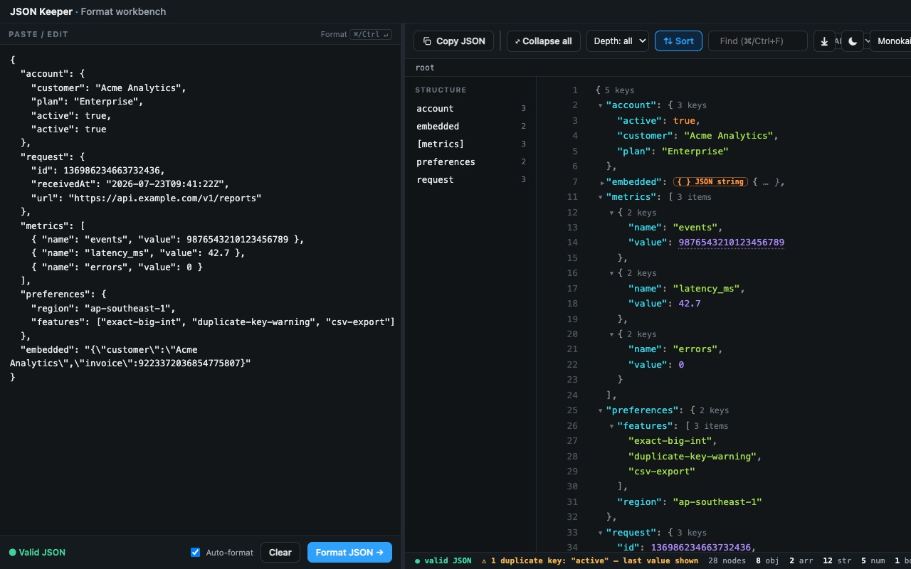

# JSON Keeper

[](https://github.com/kingxiaozhe/json-keeper/actions/workflows/ci.yml)
[](LICENSE)

本地优先、重视数据正确性的 Chrome JSON 工作台。直接打开 JSON URL、
本地文件，或粘贴文本；在左侧编辑源码，在右侧查看实时树，并始终保留
大整数的每一位。



- **不丢精度**：大整数在查看、搜索、排序与复制时保持原值，并主动提示
  重复键、浮点丢精度和数值溢出。
- **不是只读查看器**：分栏编辑、树视图、范围查找、按层级折叠、CSV
  导出与嵌套 JSON 展开在同一个工作台完成。
- **数据留在本机**：零账号、零广告、零遥测、零网络请求；扩展只有
  本地设置存储权限。

## 安装与快速开始

1. 从 [Releases](https://github.com/kingxiaozhe/json-keeper/releases)
   下载最新 ZIP 并解压，或直接克隆本仓库。
2. 打开 `chrome://extensions`，启用**开发者模式**。
3. 点击**加载已解压的扩展程序**，选择解压后的目录。
4. 点击扩展图标粘贴 JSON，或直接打开任意 `.json` URL。

查看 `file://` 本地 JSON 时，需要在扩展详情页手动开启
**允许访问文件网址**。当前仅支持 Chrome / Chromium。

## 本版已含
- 可折叠 JSON 树(caret + 节点数 `n keys`/`n items`)、行号、语法高亮、Collapse/Expand all。
- **节点 hover 复制**:每行浮出 `⧉`(复制值/子树)+ `path`(复制访问路径如 `customer.email`)。
- **真搜索**:高亮 + `1/2` 计数 + ↑↓ 跳转 + 自动展开命中父级;`/` 聚焦。
- **手动主题**:auto / ☀ / ☾ 切换并记住(Pretty/Raw/Min 选择也记住)。
- **左侧结构栏**(点顶层 key 跳转 + 滚动高亮当前区块,扁平 JSON 自动隐藏)+ **面包屑**(`root › customer › email`)。
- **Pretty / Raw / Min** 三态切换;**下载 .json**;可见 Copy(合法JSON);`✓ big-ints precise` 徽章。
- **底部状态栏**:节点数 + 类型统计 + `big integers kept exact · no ads · no telemetry`。
- **大文件保护**:超过 1MB 默认走 Raw,切到 Pretty/搜索时才懒构建树,避免卡死标签页。
- **容错解析**:自动剥离 XSSI 前缀(`)]}'`、`while(1);`)和 JSONP 包裹(`callback({...})`);v0.7 起兼容 **JSONC**(注释)和**尾逗号**。
- **按 key 排序**(递归,A→Z,显示与复制一致)+ **多皮肤**(Default / Solarized / Monokai / GitHub)。[v0.7]
- **正确性提示**[v0.8]:**重复 key 警告**(规范后者覆盖、其余被静默丢弃,我们标出来)+ **大整数计数徽章**("✓ N big-ints exact",在别处会被四舍五入)。这是别家没认真做的可信赖护城河。
- **更多正确性诊断**[v0.9]:**数字溢出提示**(超出 float64 范围 → 变成 `Infinity` → 合法 JSON 无 `Infinity`,序列化回 `null` 静默丢数据,我们标出来)+ **浮点丢精度提示**(有效位超过 float64 能表示的范围,复制出来已不等于你粘贴的值);畸形数字(如孤立的 `-`)给出带位置的 `SyntaxError` 而非晦涩报错。
- **值可读性**[v0.10]:字符串里的 **http/https 链接可点击**(严格限定 scheme + href 属性转义,杜绝 `javascript:`/`data:` 注入)+ 疑似 **Unix 时间戳**(epoch 秒/毫秒)的数字 hover 显示人类可读 UTC 时间(纯提示,无视觉噪音)+ **搜索输入防抖**(大树逐字输入不再卡顿)。
- **嵌套 JSON 字符串内联展开**[v0.11]:字段值本身是被转义的 JSON 字符串(真实 API 响应极常见)时,自动识别并作为可折叠子树**内联展开**,带 `{ } JSON string` 徽章、**默认折叠**保持整洁;折叠/搜索/复制全部复用现有机制(复制得到解析后的 JSON)。检测有首尾字符快速判定 + 体积上限,不影响普通字符串性能。
- **大数字千分位提示**[v0.12]:大整数(BigInt)与较大整数 hover 显示带千分位分隔的可读形式(如 `136,986,234,663,732,436`),便于核对位数。
- **搜索命中子串高亮**[v0.13]:命中处用 `<mark>` 实际高亮(此前仅淡化非命中行),只切分文本节点、不破坏语法高亮 span 与折叠监听器;切换查询时干净清除并重新合并文本节点,跨旧切分边界仍可命中。
- **按层级展开**[v0.14]:工具栏新增 `Depth` 下拉(仅当存在多层嵌套时出现),一键把整棵树折叠/展开到指定深度(深度 ≥ N 的容器折叠、更浅的展开),与 Collapse/Expand all 联动。`buildTree` 给每个容器 caret 标注深度并返回 `maxDepth`。
- **审查修正**[v0.14.1]:对抗式 review 后修复——丢精度诊断对尾随零的圆整数误报(`1.000…`)、畸形浮点(`1e`、`1e+`)被当作有效值/误计入溢出、`\u` 转义对非十六进制或截断输入静默产出 NUL;搜索改为单趟扫描(去掉 O(n²) 成员判定),深度下拉与"折叠全部"按钮的状态/标签去歧义。
- **超大结构守卫**[v0.15]:不仅看字节数,还按**节点数**(`countNodes`,超过 5 万即短路)判断;结构过大时**不自动构建 DOM 树**,而是给出明确提示 + "仍要渲染"入口(Raw/Min 始终流畅、大整数仍精确)。这能真正避免极大文档卡死标签页,而不是事后才发现已经卡住。
- **数组导出 CSV**[v0.16]:顶层是数组时,工具栏出现 `⤓ CSV`——对象数组转为表格(列 = 各行键的并集,首次出现顺序),其余数组转为单列 `value`;遵循 RFC-4180 转义(含逗号/引号/换行才加引号),嵌套对象/数组用紧凑 JSON、BigInt 保留精确位数。导出内容跟随排序状态。
- **左右分栏工作台 + 查找增强**[v0.17]:独立 viewer 页改为**左右分栏**——左边粘贴/编辑、右边格式化,改数据无需回到顶部;**粘贴即格式化**(可关),解析出错时左栏显示**行/列并可点击跳转**到出错位置。查找升级为编辑器级:**`⌘/Ctrl+F` 聚焦应用内查找**、**范围切换(All/Keys/Values)**、命中在折叠节点内时**自动展开其祖先**、**"只看匹配行"保留父级路径**、`Esc` 清空;并修复了旧查找会误匹配行号与行内按钮文字的问题(查找范围严格限定在键/值)。
- **全库审查修正**[v0.18]:8 视角对抗式全库 review 后修复十项——**`__proto__` 键静默丢失/污染解析对象原型**(改用 `defineProperty`,现与原生行为一致);**丢精度诊断改为精确 round-trip 比对**(16–17 位有效数字的真实丢失不再漏报);**严格数字文法**(拒绝 `01`/`1.`/`-.5`/字符串内裸控制字符/未闭合 `/*`,与原生一致、报错带位置);**单 `<pre>` 的 HTML 页不再被误接管**(lone-`<pre>` 通道要求非 HTML 类型),且**廉价门槛前置**(普通网页零全文提取开销);**大文件不再污染已保存的视图偏好**(仅用户点击才持久化);**工作台重挂载不再累积监听器/泄漏旧树**;**排序后自动重跑当前搜索**;注入全网页的 CSS 中 `#out` 选择器加了 `.jk-page` 作用域(不再影响宿主页);清除 `jsonbig.js` 中回归的裸 NUL 字节并加**源文件卫生守卫测试**。
- **性能与清理**[v0.19]:清空审查遗留——**搜索按键零 DOM 读取**(建树时预存键/值小写文本,按键只做 `includes`;高亮开销随命中数而非文档大小);**折叠改为共享行数组的索引区间**(去掉每容器 O(n·depth) 的行数组拷贝);**祖先展开/过滤改为父链回溯**(O(命中×深度));**工作台每键单次解析**(解析结果经 `opts.value/diag` 交接给 `mountViewer`);**pretty/min 惰性计算**(仅 Copy/下载/Min 视图付费);**已保存排序在首次建树前解析**(不再双重建树);**嵌套 JSON 的大整数/重复键计入徽章与警告**(重建不重复计数);缩进字符串记忆化(树 + stringify);`isContainer` 全库统一复用;theme/skin 共享 `setRootFlag`;组件色(`--jk-mark/--jk-warn/--jk-bad`)收敛进主题变量块(组件不再各带深色选择器);测试统一 `test/harness.js`。
- UI 设计语言:B(Linear 冷静)底 + A(IDE 结构栏/状态栏)+ C(信任文案);浅/深双主题。设计探索见 `design/`。

## 已知限制(后续迭代)
- 超大 JSON **窗口化虚拟滚动**仍未做(P2):v0.15 的节点守卫已避免"自动构建巨树卡死",但用户选择"仍要渲染"超大树时,仍是一次性全量 DOM,可能卡。真正的窗口化渲染(只挂载可见行)需重写折叠/搜索/结构栏协作,作为独立大改造。
- `file://` 需用户手动授权(扩展无法代勾)。
- 仅 Chrome。

## 结构

详见 [`ARCHITECTURE.md`](ARCHITECTURE.md)。核心分层:`jsonbig.js`(解析/序列化正确性)→ `jk-util.js`(纯值函数)→ `core.js`(DOM 渲染引擎 `window.JK`)→ 两个入口(`content.js` 接管 JSON 网址、`viewer.html/js` 分栏工作台)共用同一引擎。

- `manifest.json` — MV3,content script(`jsonbig.js`+`jk-util.js`+`core.js`+`content.js`)注入 http/https/file。`key` 是钉死本地开发 ID 的公钥，不是签名私钥；`./pack.sh` 会只在上传副本中移除它，由 Chrome Web Store 维持商店条目的 ID。
- `jsonbig.js` — 保真大整数的 JSON parse/stringify(核心正确性,零依赖)。
- `jk-util.js` — **纯值函数**(无 DOM、无共享状态):`esc`/`linkify`/`embeddedJSON`/`groupDigits`/`epochHint`/`posToLineCol`/`countNodes`/`toCSV`,各自独立单测。
- `core.js` — **DOM 渲染引擎**:`buildTree` + `mountViewer` + 搜索(`applySearch` 等);从 `JKUtil` 取用纯函数并统一挂在 `window.JK`。
- `content.js` — 检测 JSON 文档→**先解析成功再替换页面**(失败不动原页)。
- `popup.html/js` — 粘贴入口 → 存 storage、开 `viewer.html`。
- `viewer.html/js` — 独立**左右分栏**工作台;`viewer.js` 只管页面外壳(编辑器/校验/分栏),渲染全部委托给 `JK.mountViewer`。
- `viewer.css` — 接管页 + viewer 页共用样式(含深色)。

## 测试
- `npm test`(零依赖):
  - `test/jsonbig.test.js` —— 核心 `parse`/`stringify`:大整数保真与计数、重复 key、溢出/丢精度诊断、畸形数字报错、JSONC(注释 + 尾逗号)、转义往返与控制字符、Pretty/Min。
  - `test/core.test.js` —— 视图纯函数 `linkify`/`epochHint`/`embeddedJSON`/`groupDigits`/`countNodes`/`toCSV`/`posToLineCol`:注入面转义、时间戳与千分位、嵌套 JSON 识别、节点计数短路、CSV 转义与并集列、解析错误的行/列换算。
  - `test/tree.test.js` —— 借 `test/dom-stub.js`(零依赖 DOM 桩)在 node 下跑真实 `buildTree` + `applySearch`:类型/节点计数、折叠与展开、嵌套 JSON 内联展开、`applyDepth` 按层级折叠,以及查找的**范围(键/值)、命中祖先自动展开、只看匹配行、以及"不误匹配行号/按钮文字"**。
  - `test/highlight.test.js` —— 搜索高亮手术 `markText`/`clearMarks`:命中包裹与计数、保留嵌套结构、清除后文本还原、跨旧切分边界重搜可命中。
  - `test/viewer.test.js` —— 借升级后的 DOM 桩(含小型选择器引擎)在 node 下跑**完整 `mountViewer`**:装配出 `.jk-wrap`/树/工具栏/搜索框、状态显示 valid、Pretty↔Raw 切换、caret 折叠、数组显示 CSV、以及错误路径不抛异常。覆盖此前无测试的视图组装层。
  - 重构前的安全网。共 209 条断言(含源文件无控制字节的卫生守卫);各套件共用 `test/harness.js`(统一断言/加载器/chrome mock)。

## 发布打包

```bash
./pack.sh
```

脚本从 `manifest.json` 与扩展页面引用推导白名单，默认生成
`release-artifacts/json-keeper-<manifest version>.zip`，并从 ZIP 内的
`manifest.json` 移除仅用于本地开发 ID 的 `key`（源码清单不变）。上传前仍需查看 `unzip -l` 输出，确认包内只有运行所需文件。
